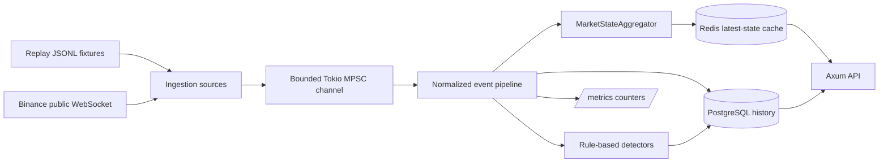

# Architecture

## Scope

SignalGuard RS is a Rust backend for market-data quality monitoring. It ingests replay fixtures and Binance public market-data streams, normalizes events, computes latest per-symbol state, emits deterministic anomalies, persists historical records, and exposes an HTTP API plus Prometheus-compatible metrics.

Out of scope:

- placing trades or managing accounts
- submitting, canceling, or routing exchange orders
- using non-public Binance account APIs
- forecasting future prices
- proving intent, abuse, or broader market-surveillance conclusions

## High-Level Flow

The same runtime pipeline handles replay and live events after normalization. The main split is at the source boundary, not in downstream business logic.

## Ingestion Modes

### Replay

- Reads normalized JSONL fixtures such as `examples/replay/sample.jsonl`
- Supports deterministic local demos and tests
- Does not require Binance network access or API keys
- Uses the same channel, pipeline, state, storage, cache, and detector path as live mode

Replay mode is the default demo path. The service binds the HTTP listener before replay reset or ingestion, then completes replay ingestion before serving API traffic. This keeps the local demo deterministic while avoiding replay storage/cache mutations when the configured HTTP port is already unavailable.

### Live

- Connects to Binance public combined streams only
- Subscribes to `trade`, `bookTicker`, and diff-depth streams
- Does not require API keys
- Reconnects with bounded exponential backoff
- Pushes normalized events through the same bounded channel as replay mode

The channel is intentionally bounded. Sources await on `send()` instead of silently dropping events.

## Event Model And Pipeline

The ingestion layer uses three core types:

- `IngestionSource`
  - `Replay` or `Binance`
- `NormalizedEvent`
  - `Trade`
  - `Quote`
  - `Depth`
- `IngestedEvent`
  - `{ source, event }`

Replay fixtures are parsed from normalized JSONL lines. Live payloads are parsed from Binance combined-stream JSON. After that point, both sources produce the same `NormalizedEvent` variants.

Pipeline behavior:

- events enter a bounded Tokio MPSC channel
- the pipeline records message freshness and per-source counters
- `Trade` and `Quote` events are persisted to PostgreSQL
- `Depth` events update runtime state and cache, but are not persisted historically
- every event updates the latest in-memory market state
- the latest state is written to Redis
- detector evaluation runs after state update
- emitted anomalies are persisted to PostgreSQL

## State Model

`MarketStateAggregator` owns runtime latest state per symbol.

It tracks:

- latest trade fields
- latest quote fields
- rolling trade window for one-minute signals
- trade-derived fields such as `price_change_1m_pct` and `trades_per_minute`
- a local top-N order book
- depth sequence gap count
- depth-derived fields such as top bid/ask quantity, top bid/ask liquidity, and book imbalance

Depth state is intentionally limited:

- it is runtime latest-state only
- it is not full historical order-book persistence
- it has no REST snapshot bootstrap yet
- it has no full Binance resync yet

The local order book applies diff-style updates, trims to a retained top-N view, and increments a gap counter when depth update IDs skip forward.

## Storage And Cache Ownership

### PostgreSQL

PostgreSQL is the historical store for:

- normalized trades
- normalized quotes
- anomaly events

Replay mode can reset these tables before ingestion so repeated demos stay deterministic.

### Redis

Redis is a latest-state cache for:

- latest `MarketState` snapshots per symbol
- cached symbol discovery via the symbol set

### Not Persisted

The following remain runtime-only in v0.4:

- full order-book history
- sliding trade window state
- trade-burst warmup or baseline state
- local order-book state itself

If the service restarts, these runtime structures are rebuilt only from new incoming events, not from PostgreSQL or Redis.

## Detector Engine

The detector engine evaluates deterministic rule-based data-quality heuristics:

- `price_move`
- `spread_spike`
- `stale_data`
- `trade_burst`
- `quote_stuck`
- `event_lag_spike`
- `depth_sequence_gap`

Implementation notes:

- detector thresholds come from configuration
- trade burst keeps symbol-local warmup state in memory
- quote-stuck and depth-sequence-gap tracking are symbol-local
- duplicate emissions are rate-limited with a cooldown
- anomalies are written to PostgreSQL after evaluation

These detectors are operational heuristics. They do not prove intent, forecast price direction, or guarantee market correctness.

## Health Model

There are three different health surfaces:

- `GET /health`
  - simple service liveness
- `GET /pipeline/health`
  - internal freshness and error-counter summary from telemetry counters
- `GET /market/{symbol}/health`
  - symbol-level market-data health derived from latest state plus recent anomalies

The market health score is:

- explainable
- penalty-based
- deterministic
- based on recent anomaly penalties and stale-state handling

It is infrastructure monitoring, not trading advice.

## API Surface

Current HTTP endpoints:

- `GET /health`
- `GET /pipeline/health`
- `GET /metrics`
- `GET /symbols`
- `GET /market/{symbol}/state`
- `GET /anomalies`
- `GET /market/{symbol}/health`

Response examples live in [docs/api-examples.md](docs/api-examples.md).

## Metrics

`GET /metrics` returns Prometheus-compatible text.

Current metrics include:

- aggregate parse, reconnect, storage, and cache error counters
- source-aware parse and reconnect counters
- processed-event counters partitioned by source and event type
  - replay trade / quote / depth
  - Binance trade / quote / depth
- `signalguard_last_message_age_ms`

Metrics are intentionally small and process-wide in v0.4. Queue depth, per-symbol metrics, and broader observability surfaces are not implemented yet.

## Runtime Modes

Local runtime paths:

- `bash scripts/demo-replay.sh`
  - primary deterministic demo path
- `cargo run`
  - direct local development path
- `docker compose --profile app up --build app`
  - optional local app-container path after explicit migrations

The optional compose app profile is a local helper, not a production deployment path.

Configuration profiles:

- `local` is the default and expects PostgreSQL and Redis URLs from `.env`, Docker Compose, or local scripts.
- `production` also requires explicit PostgreSQL and Redis URLs and does not fall back to local demo credentials.
- These boundaries are production-style configuration hygiene, not a production deployment guarantee.

## Failure And Limitation Boundaries

- Redis is a cache, not historical truth
- PostgreSQL startup is required; Redis startup failure degrades the service
- replay timestamps are historical and can intentionally trigger stale-data and event-lag anomalies
- in-memory windows and detector baselines reset on restart
- there is no REST snapshot bootstrap or full local order-book resync yet
- there is no full historical order-book persistence
- local depth signals are data-quality heuristics, not liquidity correctness promises

For runtime failure behavior, see [docs/failure-modes.md](docs/failure-modes.md). For command-level usage, see [docs/operations.md](docs/operations.md). For replay fixture structure, see [docs/replay-format.md](docs/replay-format.md).
